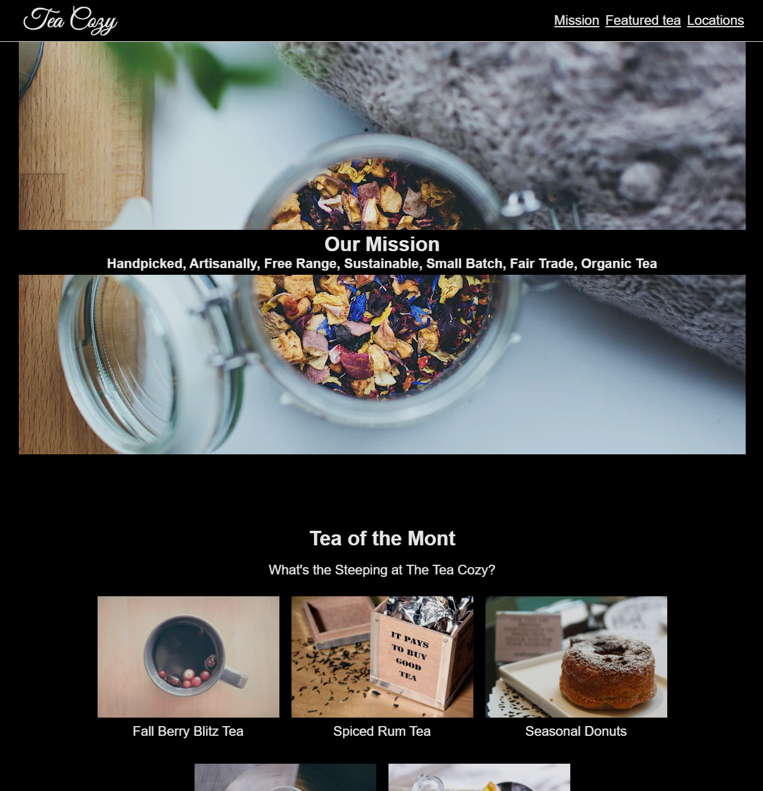
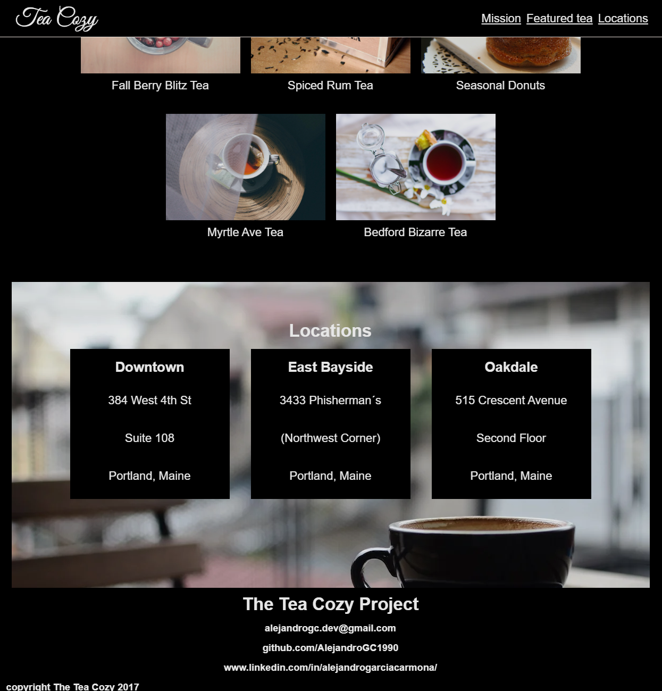

# TeaCozyCode

Proyecto web sobre una tienda de té. CSS nivel intermedio (Codecademy) y html.

- [TeaCozyCode](#teacozycode)
  - [Tecnologías utilizadas](#tecnologías-utilizadas)
  - [Imágenes](#imágenes)
  - [Requisitos previos](#requisitos-previos)
  - [Instrucciones para su instalación](#instrucciones-para-su-instalación)

## Tecnologías utilizadas

-HTML5 <br>
-CSS3 (nivel intermedio según prueba de Codecademy - https://www.codecademy.com/enrolled/courses/learn-intermediate-css)

## Imágenes 

*Guía del proyecto*


*Capturas de pantalla1*


*Capturas de pantalla2*


## Requisitos previos

- [Git](https://git-scm.com/) debe estar instalado en tu sistema.
- [Visual Studio Code](https://code.visualstudio.com/) debe estar instalado.
- La extensión [Live Server](https://marketplace.visualstudio.com/items?itemName=ritwickdey.LiveServer) debe estar instalada en VS Code.

## Instrucciones para su instalación

##### 1. Clonar el Repositorio desde GitHub

Abre tu terminal o consola y clona el repositorio utilizando el siguiente comando:

```bash
git clone https://github.com/AlejandroGC1990/TeaCozyCode.git
````

Navega al directorio del proyecto:

```bash
cd TEACOZYCODE
````

##### 2. Abrir el Proyecto en VS Code
Abre Visual Studio Code y selecciona File > Open Folder.... Navega hasta la carpeta del proyecto que acabas de clonar y ábrela.

##### 3. Instalar la Extensión Live Server
Si aún no tienes instalada la extensión Live Server, sigue estos pasos:<br>

Abre VS Code.<br>
Ve a la pestaña de extensiones haciendo clic en el icono de cuadrados en la barra lateral izquierda o presiona Ctrl+Shift+X.<br>
En el buscador de extensiones, escribe Live Server.<br>
Haz clic en Install en la extensión desarrollada por Ritwick Dey.<br>

##### 4. Ejecutar el Proyecto con Live Server
Abre el archivo index.html dentro de tu proyecto.<br>
Haz clic derecho en cualquier parte del archivo y selecciona Open with Live Server.<br>
Esto abrirá tu proyecto en tu navegador predeterminado, y cualquier cambio que guardes se actualizará automáticamente en el navegador.<br>
